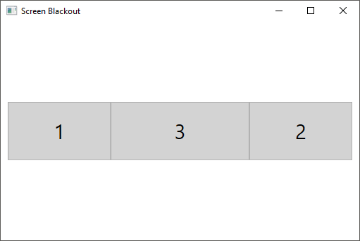

# Screen blackout

## Wat
Idk, needed something to blackout my screens.

## How
Click one or multiple of your monitors represented in the application.  
Clicking a monitor will create a black square on it, to black it out.  
Clicking the black square on that monitor removes it.

